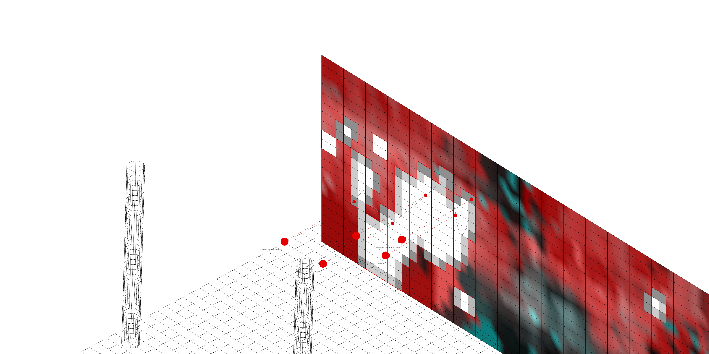
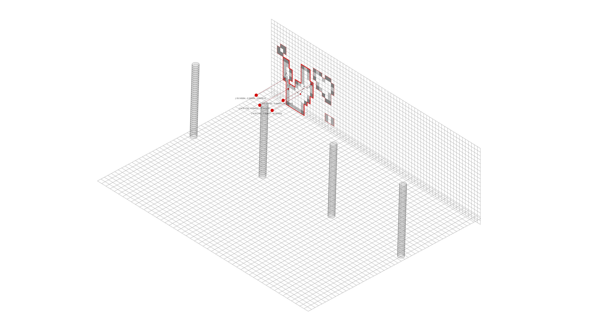
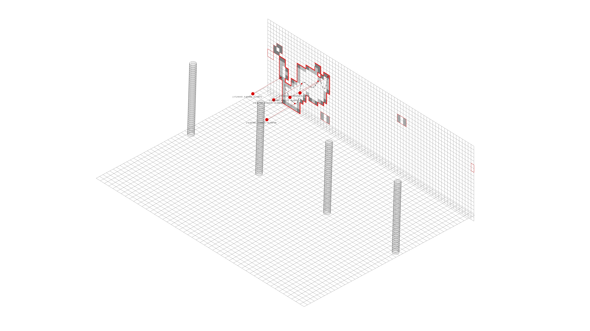
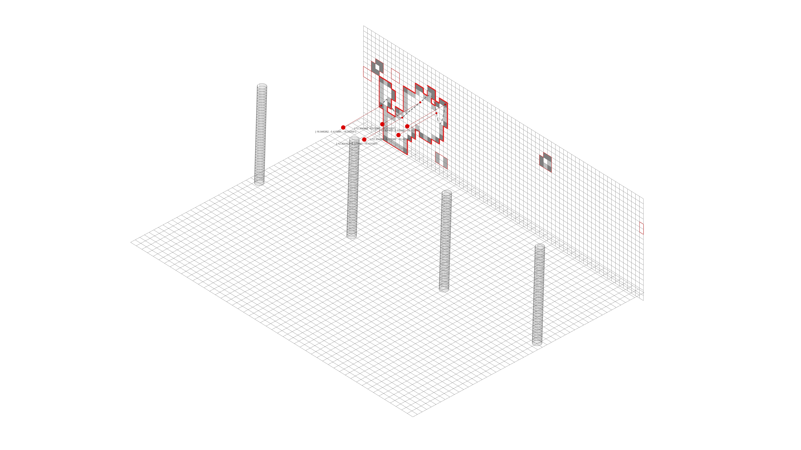
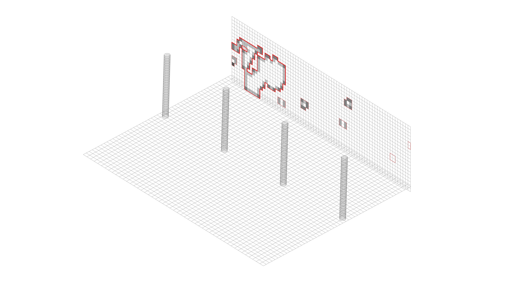
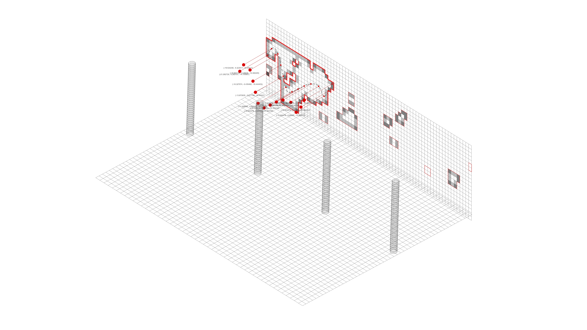
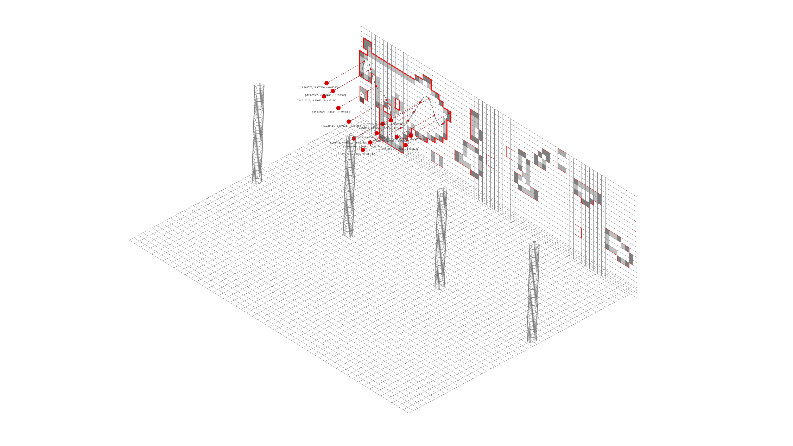
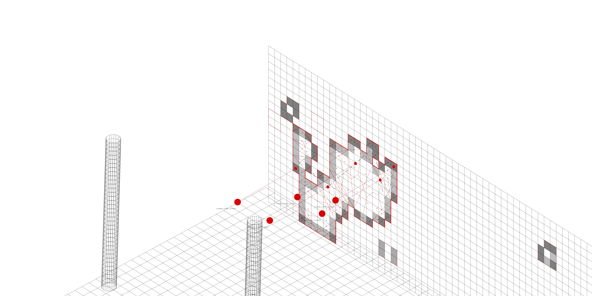
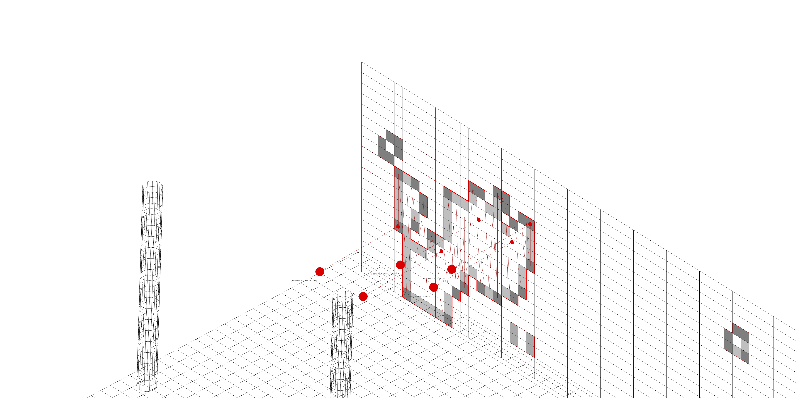

# DIGITALIZING-MATERIAL-COLLATION-FROM-PRE-DEMOLITION-SITES // Software II
### Project Description

This entry explains the method used to digitized a Pre-Demolition Site in order to create a more reliable material report of the resources available in old buildings. The report is done using images captured with a bebop 2.0.
* http://www.iaacblog.com/programs/digitalizing-material-collation-pre-demolition-sites/

In this project we perform a building inspection with a manual flight, we then process the collected information and do second flight if more data is needed. For the second flight we use way points and the controller developed in the following repository:
* https://github.com/MRAC-IAAC/bebop_control

This repository also explains how to get the points of interest for the mission planner in the second flight of this project. The potential areas of interest are those that we couldn’t determine the material (white area).

**Area of interest**


**Selected points from mesh topology**


#### Requierements

* ROS Indigo, Jade or Kinetic
* Basic familiarity with building ROS packages
* Parrot Bebop 2.0

* **Rhinoceros 6**

To download the Rhino file click [HERE](https://drive.google.com/drive/folders/1oU48m0Eazm6iBU8ubfr_FgoaLeqjJuxY?usp=sharing)
Grasshopper Plugins:

* [FroGH](http://www.co-de-it.com/wordpress/frogh.html)
* Pufferfish
* Weaverbird
* Human
* Firefly
* Parakeet

*Tested on Rhinoceros Version 6 SR23 (6.23.20055.13111, 02/24/2020) and Ubuntu 16.04*

#### Getting Started:

Install [bebop_autonomy]( https://bebop-autonomy.readthedocs.io/en/latest/installation.html) package inside your conventional ROS catkin workspace and make sure to compile them once the installation has finished ($ catkin_make).

For the point detection we make use of the images and colors established in this technology implementation:

* https://github.com/MRAC-IAAC/material_localization

The grasshopper file already provides internalized meshes with the corresponding colors for each element. Personalized geometry will required to run the *material_localization* with the correct inputs.

#### Workflow

MANUAL FLIGHT + CAPTURE IMAGES
```
1. Place DRONE
2. Connect to Bebop2Power Wi-Fi Network
3. Terminal 1. To start Drone via ROS

$ locate libarcommands.so
	answer: /opt/ros/melodic/lib/parrot_arsdk/libarcommands.so
$ export LD_LIBRARY_PATH=$LD_LIBRARY_PATH:/opt/ros/melodic/lib/parrot_arsdk/

$ roslaunch bebop_driver bebop_node.launch
(It will give errors if its not connected to the drone)

4. Terminal 2. To use the Joystick Controller
* cd iaac_eurecat_ws/src/bebop_autonomy/ bebop_tools/config
$ roslaunch bebop_tools joy_teleop.launch

6. Terminal 3. Drone camera
$ rosrun image_view image_view image:=/bebop/image_raw

7. Terminal 4. To save images
$ cd Documents/ (name of the folder where we want to save the documents)
$ rosrun image_view image_saver image:=/bebop/image_raw

```

AUTONOMOUS FLIGHT
```
1. Place DRONE
2. Connect to Bebop2Power Wi-Fi Network
3. Terminal 1. To start Drone via ROS
$ iaac_eurecat_ws/
$ locate libarcommands.so
	answer: /opt/ros/melodic/lib/parrot_arsdk/libarcommands.so
$ export LD_LIBRARY_PATH=$LD_LIBRARY_PATH:/opt/ros/melodic/lib/parrot_arsdk/

* go inside cd + iaac_eurecat_ws/src/bebop_autonomy/ bebop_driver/launch
$ roslaunch bebop_driver bebop_node.launch
(It will give errors if its not connected to the drone)

4. Terminal 2. To start Drone via ROS
go inside iaac_eurecat_ws /src/bebop_autonomy/scripts
$ python bebop_position_controller_yaw_pid.py
Use the keyboard for movement
```
Keyboard:
S= Stop and go to zero; L= Land ; N= Navigation mode; T= Take off

Make sure to reset the terminals before starting a new flight.

For precaution place the finger in L, in case the drone doesn't behave as spectated press it immediately.

In order to imput the way points, the file that needs to be modify is the way points yaw-py.


GETTING THE WAY POINTS

In this example file we were using the color *Yellow* to find the area related to wood, this means that for the brick wall, a piece of it was opaque by pieces of wood. A path is implemented to try to get more information about this particular part.

In each element we use the colors in the mesh vertices to test color inclusion by color threshold in RGB mode for:

* [255, 0, 0] Red = Bricks
* [0, 255, 0] Green = Metal
* [0, 0, 255] Blue = Concrete
* [255, 255, 0] Yellow = Wood
* [128, 128, 128] Gray = Other Materials

For the wall the percentage of materials in the element was as following with a threshold of 0.5 for each color:

* Bricks = **48.8%**
* Metal = **7.6%**
* Concrete = **5.3%**
* **Wood = 7.2%**
* Others = **31.1%**

* **1)** Extract the mesh faces based on the selection of neighbor faces indexes for each vertex based on the previous selection of colors (in this case Yellow).
Is possible to tweak the color treshold to adapt it for the best possible fit. The number of points it's related to the size of the selected area *(more research has to be done here to adapt the distance between points to the required overlay of the images to get the best possible outcome for photogrammetry).*








* **2)** Combine the face meshes and do a second selection of the largest area.
* **3)** Remesh the resulting mesh outline to get average points from the centers.



* **4)** Offset the points based on the mesh normals.


#### Credits
Digitalizing Material Collation from Pre-Demolition Sites is a project of IaaC, Institute for Advanced Architecture of Catalonia developed in the Masters of Robotics and Advanced Construction in 2019/20 by: Students: Anna Batallé, Irem Yagmur Cebeci, Matthew Gordon, Roberto Vargas Faculty: Angel Munoz, Soroush Garivani
